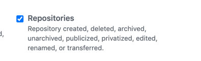

[](https://github.com/iHOMIES/webhook_listener/actions) 

# webhook_listener
This web application helps to trigger a series of tasks that will allow
you to define a default intial configuration for all your repositories
in a particular GitHub Organization.

## Installation
```
docker build . -t webhook_listener:latest
```

## Usage

```
docker run \
    --env GITHUB_TOKEN=${your_token} \
    --env WEBHOOK_SIGNATURE=${your_webhook_signature} \
    -p 3000:3000 \
    webhook_listener:latest
```

## Configuration

Create a GitHub token and key for webhook signature.
1. Follow the steps detailed in [here](docs/Configuration.md) to create the GitHub Token.


2. Create a webhook and define a key for securing it using these [instructions](docs/Configuration.md).

   Only `Repositories` event is required, but you can configure more depending on specific use cases.
   


## Contributing
We would love you to contribute to this project, pull requests are very welcome! Please see CONTRIBUTING.md for more information.

## Limitations
* If using GitHub free account, you need to work only with public repos.


## TODO

* Enable ssl/tls encryption if certificates are provided
* Add repo commit including
  * Jenkinsfile/GitHub Workflow
  * Adding LICENSE file if not exists
  * Adding Dockerfile template
* Enable alerts to chat systems (slack, flowdock, hipchat)
* Add default Wiki
* Add default Project template (kanban)

## LICENSE
[Apache 2.0](LICENSE)
