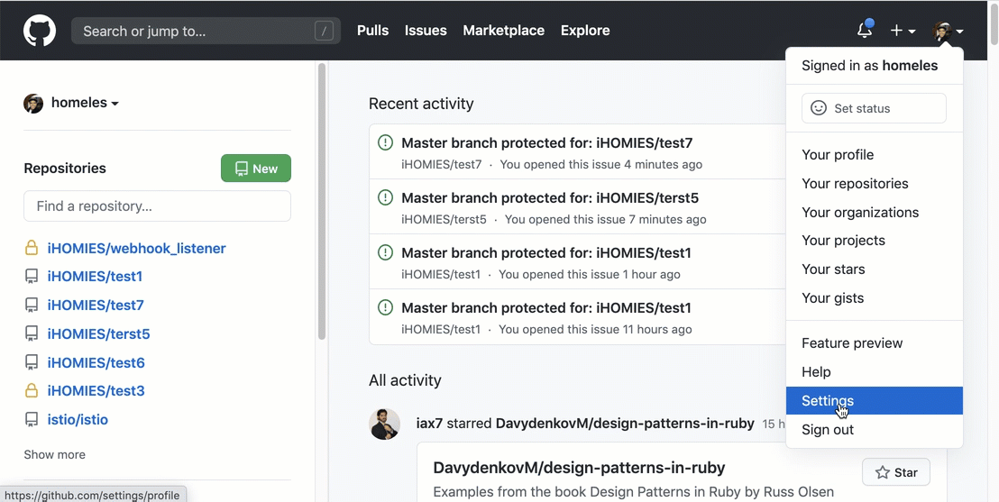
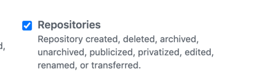

## Create GitHub token
Get a github token and key for webhook signature.
1. Follow these steps to create GitHub Token.



Refs: https://docs.github.com/en/github/authenticating-to-github/creating-a-personal-access-token#creating-a-token


## Create Webhook

Generate key for Webhook verification
```
$ ruby -rsecurerandom -e 'puts SecureRandom.hex(20)'
3710f2c6bb57cfaf49944ed41296e18d7b719b7d
```

Create webhook in GitHub
Once you have the key create a webhook and paste it in the secret configuration.


You only need `Repositories` event but you can enable more depending in use case.


Refs: https://docs.github.com/en/developers/webhooks-and-events/securing-your-webhooks
